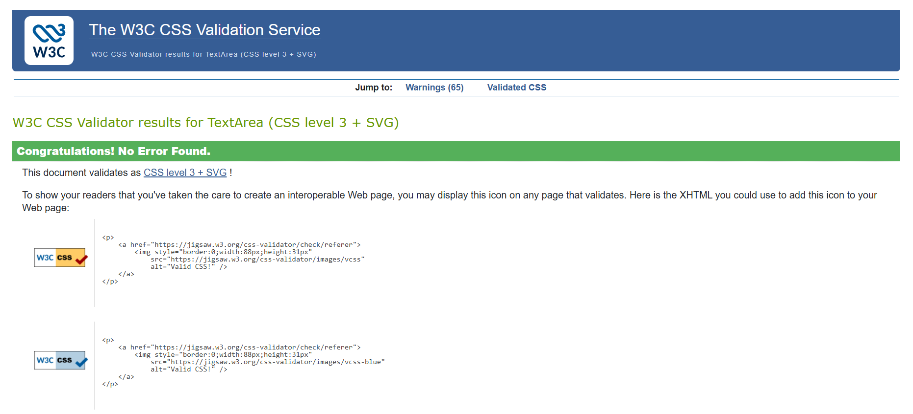
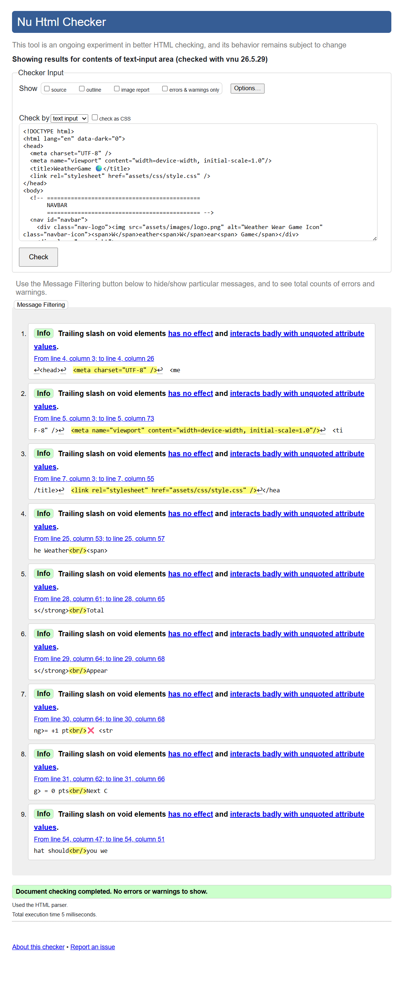

## 🧪 Testing & Validation

---

### ✋ Manual Testing

📝 Manual testing was carried out on all three screens to verify that every interactive element works correctly.

🔘 Screen 1 — Start Screen

- The Start Game button was tested and successfully launches the game. 
- The dark mode toggle was tested and correctly switches between dark and light mode. 
- The high score display was tested and shows the correct saved score on page load.

🔘 Screen 2 — Game Screen

- The 45 second game timer was tested and counts down correctly, turning red at 10 seconds remaining.
- The city counter and score display were both tested and update correctly after each round.
The weather banner was tested and correctly displays the city name, country flag, weather emoji, temperature, and background GIF for each weather type.
- The outfit cards were tested by clicking the correct outfit, which turns green and displays a correct feedback message with +1 point.
- Clicking a wrong outfit was tested and turns the selected card red while revealing the correct card in green, with a wrong feedback message showing −1 point. 
- Waiting without clicking was tested and correctly reveals the correct card after 3 seconds with a timeout feedback message and no score change. 
- After each answer all cards were tested and confirmed to be disabled until the next round loads.

🔘 Screen 3 — End Screen

- The end screen was tested and correctly displays the final score and the matching end  message based on the score.
- The new high score badge was tested and appears when the best score is beaten.
- The Play Again button was tested and successfully restarts the game.
- The Home button was tested and correctly returns to screen 1.

📱 Responsive Testing

- Tested on multiple screen sizes:
- Mobile (375px)
- Tablet (768px)
- Desktop (1920px)
-  The layout, grid columns, and text adjusted correctly at each screen size.
- All HTML and CSS files were tested using official W3C validators.
- Full validation results and screenshots are documented in this file.
- Performance Testing:
- A Lighthouse audit was performed to review Performance, Accessibility, Best Practices, and SEO.
- All results and notes are included bellow:

### CSS
For validating my style sheet I used a validator from [W3C Validation Service](https://jigsaw.w3.org/css-validator/#validate_by_input).
The validation returned no errors, only a few warnings that can be ignored. Please see the results of the validation below. 

[css-file](assets/css/style.css)

### HTML
I also validated each of my HTML files using the [W3C Validation Service](https://validator.w3.org/#validate_by_input).
There are no erros or warnings on the HTML validations. Below are the validation results for my HTML pages.

---
## 📌Lighthouse Testing

Lighthouse is a Chrome tool that analyzes my website’s performance, accessibility, best practices, and SEO, and provides scores and recommendations for improvement.

## ⚡Performance, Accessibility, Best Practices and SEO validations

#### Screen1 - 🖥️Desktop

#### Screen1 - 📱Mobile

#### Screen2 - 🖥️Desktop

#### Screen2 - 📱Mobile

#### Screen3 - 🖥️Desktop

#### Screen3 - 📱Mobile

